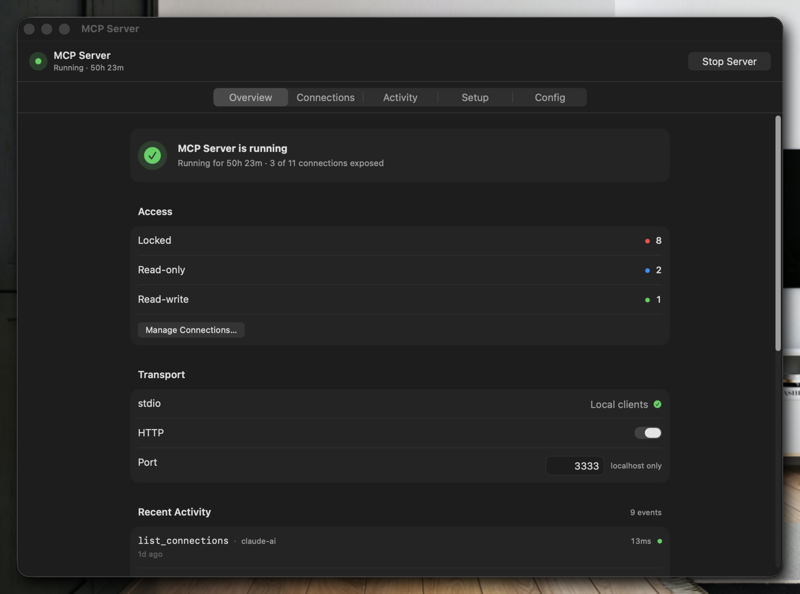
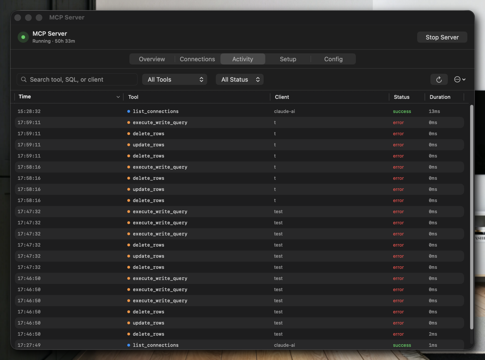

<h1 align="center">Gridex</h1>

<p align="center">
  <strong>AI-native database IDE for macOS and Windows.</strong><br>
  One app for PostgreSQL, MySQL, SQLite, Redis, MongoDB, and SQL Server — with a built-in MCP server and AI chat.
</p>

<p align="center">
  
  
  
  
</p>

<p align="center">
  
</p>

---

## Supported Databases

<p align="center">
  
  
  
  
  
  
</p>

<p align="center">
  <em>Six drivers in one native binary. All share the same <code>DatabaseAdapter</code> protocol (~50 methods) so every feature — grid, query editor, ER diagram, backup, MCP — works identically across engines.</em>
</p>

---

## Why Gridex

- **Native.** AppKit on macOS, WinUI 3 on Windows. No Electron, no web views for the grid.
- **Multi-database.** Six drivers in one binary, each with the right primitives (SCAN for Redis, aggregations for MongoDB, stored procedures for SQL Server, sequences for Postgres).
- **AI that sees your schema.** Claude, GPT, Gemini, and Ollama can read your tables, run read-only queries, and write SQL scoped to the connection you pick.
- **MCP server built in.** Plug Gridex into Claude Desktop, Cursor, or any MCP client over stdio — 13 tools with a 3-tier permission model and audit trail.
- **Credentials stay local.** macOS Keychain / Windows Credential Manager. No cloud sync, no telemetry, no proxy.

---

## Driver Highlights

| Database | Driver | Highlights |
|----------|--------|------------|
| **PostgreSQL** | [PostgresNIO](https://github.com/vapor/postgres-nio) | Parameterized queries, mTLS, sequences, full schema inspection |
| **MySQL** | [MySQLNIO](https://github.com/vapor/mysql-nio) | Charset handling, parameterized queries, TLS, auto-reconnect with keepalive |
| **SQLite** | System `libsqlite3` | File-based, WAL mode, zero config |
| **Redis** | [RediStack](https://github.com/swift-server/RediStack) | Key browser, SCAN filter, Server INFO dashboard, Slow Log viewer, `rediss://` TLS |
| **MongoDB** | [MongoKitten](https://github.com/orlandos-nl/MongoKitten) | Document editor, NDJSON backup/restore, aggregation pipeline |
| **SQL Server** | [CosmoSQLClient](https://github.com/vkuttyp/CosmoSQLClient-Swift) | TDS 7.4 (no FreeTDS), native `BACKUP DATABASE`, stored procedures |

---

## MCP Server

Expose any saved connection to MCP clients (Claude Desktop, Cursor, custom agents) over stdio. Every tool call runs through a permission gate and is recorded in the audit log.

<p align="center">
  
</p>

**13 tools across 3 permission tiers:**

| Tier | Tools | When it runs |
|------|-------|--------------|
| **Read** (metadata) | `list_connections`, `list_schemas`, `list_tables`, `describe_table`, `list_relationships`, `get_sample_rows` | Always allowed for enabled connections |
| **Read** (query) | `query`, `explain_query`, `search_across_tables` | Allowed in `read_only`+ modes; SQL sanitizer rejects write statements |
| **Write** (mutations) | `insert_rows`, `update_rows`, `delete_rows`, `execute_write_query` | Only in `read_write` mode; row-count estimator flags bulk changes; user approval required |

**Security layers** in [`macos/Services/MCP/Security/`](macos/Services/MCP/Security/):

- `MCPPermissionEngine` — per-connection mode (`locked`, `read_only`, `read_write`)
- `MCPSQLSanitizer` — rejects DDL/DML that escape the declared tier
- `MCPIdentifierValidator` — guards against SQL injection in identifiers
- `MCPRowCountEstimator` — previews how many rows a mutation will touch
- `MCPRateLimiter` — caps calls per tool per minute
- `MCPApprovalGate` — prompts the user for destructive actions

<p align="center">
  
</p>

Every tool invocation lands in the activity log with tier, SQL, duration, row count, and approval state — so you can answer *"what did the agent do last night?"* without guessing.

---

## ER Diagram

<p align="center">
  
</p>

- Pure Swift renderer on macOS; Dagre + WebView on Windows — no external d2/Graphviz binary.
- Auto-layout, pan, zoom, fit-to-view, FK relationship routing.
- Reads live schema from the active adapter — no separate import step.
- Click a column to jump to its table; double-click to open data.

---

## AI Chat

Built-in chat that understands your schema and writes SQL scoped to the selected connection.

- **Anthropic Claude** — streaming, tool use, extended thinking
- **OpenAI** — GPT-4.x / 5.x, function calling
- **Google Gemini** — Flash and Pro
- **Ollama** — local LLMs, no API key needed

Requests go direct from your machine to the provider. Gridex never proxies prompts. API keys live in the macOS Keychain / Windows Credential Manager.

---

## Editor & Grid

**Data grid**
- Inline cell editing with type-aware parsing
- Sort, filter, paginate, column resize, multi-column sort
- Add/delete rows with pending-change tracking — commit as one transaction
- Copy rows, export to CSV / JSON / SQL

**Query editor**
- Multi-tab with Chrome-style tab bar grouped by database
- Syntax highlighting (keywords, strings, numbers, comments, functions)
- Execute selection or all
- Redis CLI mode for Redis connections
- Query history persisted via SwiftData — searchable, favoritable

**Schema tools**
- Structure viewer: columns, indexes, foreign keys, constraints
- Function and stored-procedure inspector (source + parameters)
- Create Table / Create Database sheets with type-aware defaults

---

## SSH Tunnel

Password, private-key, or key-with-passphrase auth. Local port forwarding via `swift-nio-ssh`. Managed by the `SSHTunnelService` actor — one tunnel per active connection, torn down on disconnect.

## mTLS (Teleport-style)

Connections support `sslKeyPath` + `sslCertPath` + `sslCACertPath` for mutual TLS. Works end-to-end for PostgreSQL, MySQL, and Redis — drop in the certs a tool like Teleport issues and connect as usual.

## Backup & Restore

| Database | Backup |
|----------|--------|
| PostgreSQL | `pg_dump` (custom / SQL / tar) + `pg_restore` |
| MySQL | `mysqldump` + `mysql` |
| SQLite | File copy |
| MongoDB | NDJSON (one doc per line, pure Swift) |
| Redis | JSON snapshot via SCAN (pure Swift) |
| SQL Server | Native `BACKUP DATABASE` |

Selective table backup, compression, and progress reporting for the CLI-backed formats.

## Import

Connections import from **TablePlus**, **Navicat** (NCX with Blowfish decrypt), **DataGrip**, and **DBeaver** — including SSH configs and keychain-stored passwords.

---

## Requirements

### macOS
- macOS 14.0 (Sonoma) or later
- Swift 5.10+ / Xcode 15+

### Windows
- Windows 10 or later (64-bit)
- Visual Studio 2022+, .NET 8 SDK, vcpkg

## Build & Run

### macOS

```bash
git clone https://github.com/gridex/gridex.git
cd gridex

# Debug (ad-hoc signed, fast local testing)
swift build
.build/debug/Gridex

# Or build .app bundle
./scripts/build-app.sh
open dist/Gridex.app
```

### Release

```bash
# Apple Silicon
./scripts/release.sh                  # → dist/Gridex-<version>-arm64.dmg

# Intel
ARCH=x86_64 ./scripts/release.sh      # → dist/Gridex-<version>-x86_64.dmg

# Both architectures
./scripts/release-all.sh
```

Pipeline: `swift build` → `.app` bundle → code sign → notarize → staple → DMG → sign DMG → notarize DMG.

| Variable | Description |
|----------|-------------|
| `ARCH` | `arm64` or `x86_64` (default: host) |
| `SIGN_IDENTITY` | Developer ID certificate SHA-1 (or set in `.env`) |
| `NOTARY_PROFILE` | `notarytool` keychain profile (default: `gridex-notarize`) |
| `NOTARIZE` | Set to `0` to skip notarization |

Auto-update is delivered via [Sparkle](https://sparkle-project.org). Release artifacts are signed, stapled, and advertised via an appcast feed.

---

## Architecture

Clean Architecture, 5 layers. Dependencies point inward.

```
gridex/
├── macos/                    macOS app (Swift, AppKit + SwiftUI)
│   ├── App/                  Lifecycle, DI container, AppState
│   ├── Core/                 Protocols, models, enums — zero deps
│   │   ├── Protocols/        DatabaseAdapter, LLMService, SchemaInspectable, MCPTool
│   │   └── Models/           RowValue, ConnectionConfig, QueryResult, MCPAuditEntry
│   ├── Domain/               Use cases, repository protocols
│   ├── Data/                 Adapters + SwiftData persistence + Keychain
│   │   └── Adapters/         SQLite, PostgreSQL, MySQL, MongoDB, Redis, MSSQL
│   ├── Services/             Cross-cutting
│   │   ├── QueryEngine/      ConnectionManager, QueryEngine, QueryBuilder
│   │   ├── AI/               Anthropic, OpenAI, Gemini, Ollama providers
│   │   ├── MCP/              MCPServer, StdioTransport, Tools (Tier1/2/3), Security
│   │   ├── SSH/              SSHTunnelService (NIOSSH)
│   │   └── Export/           ExportService, BackupService
│   └── Presentation/         AppKit views, SwiftUI settings, ViewModels
├── windows/                  Windows app (C++, WinUI 3)
├── scripts/                  Build and release automation
└── Package.swift             SPM manifest
```

**Key protocols**

- `DatabaseAdapter` — connection lifecycle, queries, schema, CRUD, transactions, pagination. All 6 adapters conform.
- `LLMService` — streaming AI responses via `AsyncThrowingStream`. All 4 providers conform.
- `SchemaInspectable` — full schema snapshot for the AI context engine and ER diagram.
- `MCPTool` — MCP tool contract with tier, input schema, and permission-checked execute.

**Concurrency**

- `actor` for thread-safe services: `QueryEngine`, `ConnectionManager`, `SSHTunnelService`, `BackupService`, `MCPServer`.
- `async/await` throughout — no completion handlers.
- `Sendable` on all data models.

**Dependency injection**

`DependencyContainer` (singleton) composes services at launch. SwiftData `ModelContainer` is shared across windows. Services are injected via the SwiftUI environment.

---

## Dependencies

| Package | Version | Purpose |
|---------|---------|---------|
| [postgres-nio](https://github.com/vapor/postgres-nio) | 1.21.0+ | PostgreSQL driver |
| [mysql-nio](https://github.com/vapor/mysql-nio) | 1.7.0+ | MySQL driver |
| [swift-nio-ssl](https://github.com/apple/swift-nio-ssl) | 2.27.0+ | TLS for NIO-based drivers |
| [swift-nio-ssh](https://github.com/apple/swift-nio-ssh) | 0.8.0+ | SSH tunnel support |
| [RediStack](https://github.com/swift-server/RediStack) | 1.6.0+ | Redis driver |
| [MongoKitten](https://github.com/orlandos-nl/MongoKitten) | 7.9.0+ | MongoDB driver (pure Swift) |
| [CosmoSQLClient-Swift](https://github.com/vkuttyp/CosmoSQLClient-Swift) | main | MSSQL via TDS 7.4 |
| [Sparkle](https://github.com/sparkle-project/Sparkle) | 2.6.0+ | macOS auto-update |

System library: `libsqlite3` (linked at build time).

---

## Contributing

Contributions are welcome. Please open an issue first to discuss what you'd like to change.

See [CONTRIBUTING.md](CONTRIBUTING.md) and [CODE_OF_CONDUCT.md](CODE_OF_CONDUCT.md).

## License

Licensed under the [Apache License, Version 2.0](LICENSE).

Copyright © 2026 Thinh Nguyen.

You may use, modify, and distribute this software — including in commercial or closed-source products — provided you preserve the copyright notice and NOTICE file. See the LICENSE for full terms.
